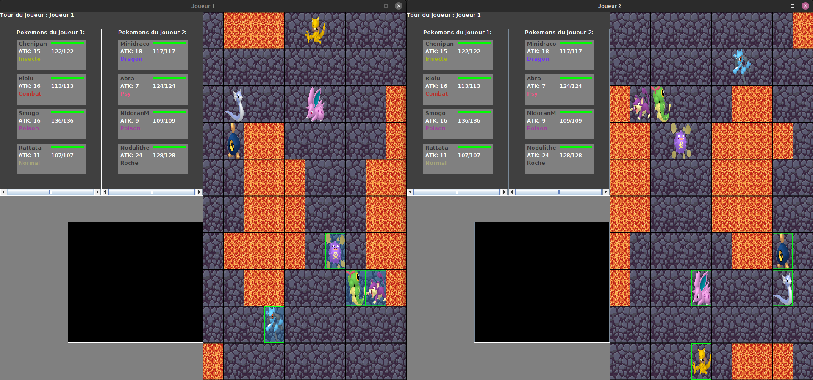
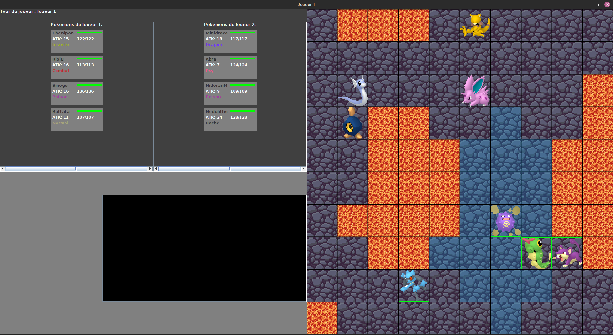
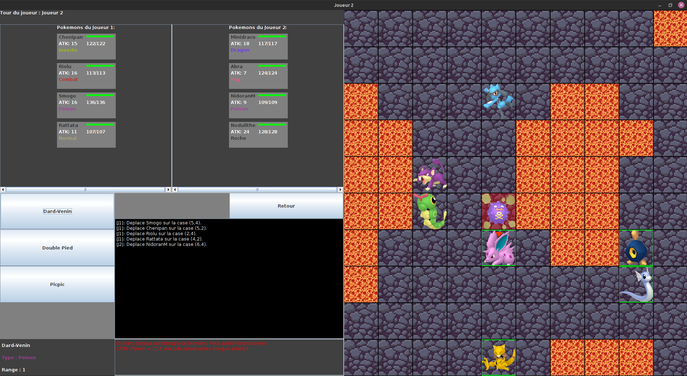
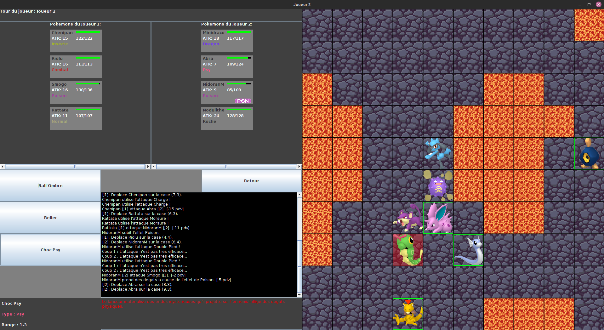
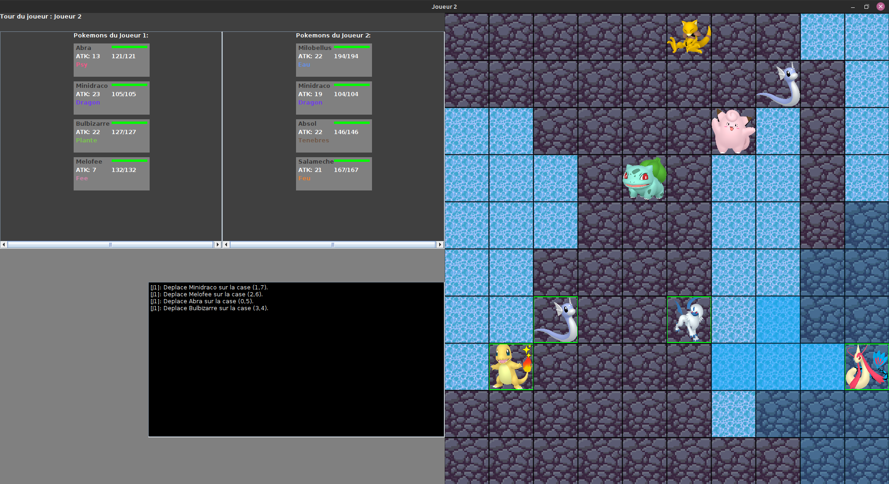

# Présentation

Notre Projet est une adaptation sur ordinateur en langage JAVA du jeu Pokémon Conquest, inspiré de la célèbre série de jeux vidéo Fire Emblem.

# Images







# Auteurs
- Adrien LE NINIVEN 
- Wissam GHANEM 
- Mouloud AMARA 
- Nawfel TOKO 
- Henri Bergson TRAN

Encadrant: M. Enrique Román Calvo

# Installation
 - Cloner le dépôt :
```
git clone https://gaufre.informatique.univ-paris-diderot.fr/amara/pokemon.git
```

```
git clone git@gaufre.informatique.univ-paris-diderot.fr:amara/pokemon.git
```
- Aller dans le répertoire du projet : `cd pokemon`

- Exécuter gradle wrapper 
 :
```
./gradlew build
```
- Lancer le jeux 
```
./gradlew run
```
